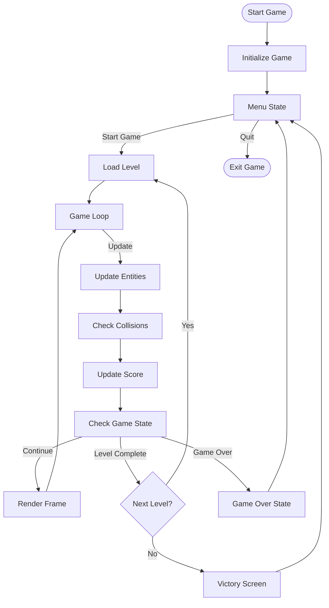

# Pacman Java 21 (Building)

A modern implementation of the classic Pacman game built with Java 21.

## Project Overview

This project is a complete recreation of the classic arcade game Pacman, featuring all the original gameplay elements including ghosts with unique behaviors, power pellets, fruits, and multiple levels.

## Directory Structure

```
pacman-java-21/
│
├── src/
│   ├── main/
│   │   ├── java/
│   │   │   ├── com/
│   │   │   │   ├── pacman/
│   │   │   │   │   ├── Main.java                    # Application entry point
│   │   │   │   │   ├── GameLoop.java                # Main game loop
│   │   │   │   │   ├── GamePanel.java               # Game rendering panel
│   │   │   │   │   │
│   │   │   │   │   ├── model/                       # Model classes package
│   │   │   │   │   │   ├── Direction.java           # Direction enum
│   │   │   │   │   │   ├── Position.java            # Maze position class
│   │   │   │   │   │   ├── Tile.java                # Maze tile type enum
│   │   │   │   │   │   ├── Level.java               # Level representation
│   │   │   │   │   │
│   │   │   │   │   ├── entity/                      # Game entities package
│   │   │   │   │   │   ├── Entity.java              # Base entity class
│   │   │   │   │   │   ├── MovableEntity.java       # Base movable entity class
│   │   │   │   │   │   ├── Pacman.java              # Pacman player class
│   │   │   │   │   │   ├── Ghost.java               # Base ghost class
│   │   │   │   │   │   ├── Blinky.java              # Red ghost implementation
│   │   │   │   │   │   ├── Pinky.java               # Pink ghost implementation
│   │   │   │   │   │   ├── Inky.java                # Blue ghost implementation
│   │   │   │   │   │   ├── Clyde.java               # Orange ghost implementation
│   │   │   │   │   │   ├── Fruit.java               # Special items/fruits class
│   │   │   │   │   │
│   │   │   │   │   ├── maze/                        # Maze package
│   │   │   │   │   │   ├── Maze.java                # Maze class
│   │   │   │   │   │   ├── MazeLoader.java          # Maze file loader
│   │   │   │   │   │
│   │   │   │   │   ├── util/                        # Utilities package
│   │   │   │   │   │   ├── SpriteLoader.java        # Sprite loader
│   │   │   │   │   │   ├── SoundPlayer.java         # Sound player
│   │   │   │   │   │   ├── ScoreManager.java        # Score manager
│   │   │   │   │   │
│   │   │   │   │   ├── state/                       # Game states package
│   │   │   │   │   │   ├── GameState.java           # Game state interface
│   │   │   │   │   │   ├── PlayingState.java        # Active gameplay state
│   │   │   │   │   │   ├── MenuState.java           # Menu state
│   │   │   │   │   │   ├── GameOverState.java       # Game over state
│   │   │   │   │   │   ├── StateManager.java        # State manager
│   │   │   │   │   │
│   │   ├── resources/                               # Game resources
│   │   │   ├── sprites/                             # Game sprites
│   │   │   ├── sounds/                              # Game sounds
│   │   │   ├── levels/                              # Level files
│   │
│   ├── test/                                        # Unit tests
│
├── pom.xml                                          # Maven configuration file
├── README.md                                        # Project documentation
```

## Game Architecture

The game follows a modular architecture with clear separation of concerns:

- **Main** - Application entry point that initializes the game
- **GameLoop** - Controls the game timing and update/render cycle
- **GamePanel** - Handles rendering of all game elements
- **State Management** - Different game states (Menu, Playing, Game Over)
- **Entity System** - Hierarchical system for game objects
- **Maze Management** - Represents and controls the game maze
- **Utilities** - Support classes for resources and game mechanics

## Game Flow

The following diagram represents the core game flow:



## Key Features

- Classic Pacman gameplay
- Four unique ghosts with different AI behaviors:
  - **Blinky** (Red): Direct chaser
  - **Pinky** (Pink): Ambusher
  - **Inky** (Blue): Unpredictable
  - **Clyde** (Orange): Random movement
- Power pellets that temporarily allow Pacman to eat ghosts
- Multiple levels with increasing difficulty
- Score system with high score tracking
- Classic sound effects

## Building the Project

This project uses Maven for dependency management and building:

```bash
# Clone the repository
git clone https://github.com/yourusername/pacman-java-21.git

# Navigate to the project directory
cd pacman-java-21

# Build the project
mvn clean package

# Run the game
java -jar target/pacman-java-21.jar
```

## Requirements

- Java 21 or higher
- Maven 3.6 or higher

## Controls

- **Arrow Keys**: Move Pacman
- **P**: Pause game
- **ESC**: Return to menu
- **Enter**: Select menu options

## Testing

Run the tests using Maven:

```bash
mvn test
```

## License

This project is licensed under the MIT License - see the LICENSE file for details.

## Acknowledgments

- Original Pacman game by Namco
- All contributors and testers

## Pacman Game Flow: 

flowchart TD
    Start([Start Game]) --> Initialize[Initialize Game]
    Initialize --> Menu[Menu State]
    
    Menu -->|Start Game| LoadLevel[Load Level]
    LoadLevel --> GameLoop[Game Loop]
    
    GameLoop -->|Update| UpdateEntities[Update Entities]
    UpdateEntities --> CheckCollisions[Check Collisions]
    CheckCollisions --> UpdateScore[Update Score]
    UpdateScore --> CheckGameState[Check Game State]
    
    CheckGameState -->|Continue| Render[Render Frame]
    Render --> GameLoop
    
    CheckGameState -->|Level Complete| NextLevel{Next Level?}
    NextLevel -->|Yes| LoadLevel
    NextLevel -->|No| Victory[Victory Screen]
    
    CheckGameState -->|Game Over| GameOver[Game Over State]
    
    GameOver --> Menu
    Victory --> Menu
    
    Menu -->|Quit| Exit([Exit Game])